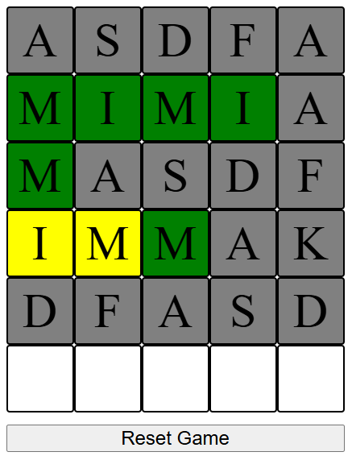

# WORDLE

Wordle.

What are the Wordle rules?

- Letters that are in the answer and in the right place turn green.
- Letters that are in the answer but in the wrong place turn yellow.
- Letters that are not in the answer turn gray.
- Answers are never plural.
- Letters can appear more than once.

## Table of Contents

- [Technologies used](#technologies)
- [Installation](#installation)
- [Usage](#usage)
- [Features](#features)
- [Contributing](#contributing)
- [License](#license)
- [Acknowledgements](#acknowledgements)

## Technologies

- Vite+React+JS

```
useState()
useRef()
```

## Installation

```bash

# Install dependencies
npm install

# Start the application
npm run dev
```

## Usage

- Type directly to see the word on the screen.
- Hit enter to send the word.



## Features

- Enter Words.
- Jump line to line to see the typing.
- Reset game.

## Contributing

How to contribute:

1. Fork the project
2. Create a new branch (`git checkout -b feature-branch`)
3. Make your changes
4. Commit your changes (`git commit -m 'Add new feature'`)
5. Push to the branch (`git push origin feature-branch`)
6. Open a Pull Request

## License

Open-source license.

## Acknowledgements

Inspired by

- [NYTIMES-Wordle-link](https://www.nytimes.com/games/wordle/index.html)

---

# React + Vite

This template provides a minimal setup to get React working in Vite with HMR and some ESLint rules.

Currently, two official plugins are available:

- [@vitejs/plugin-react](https://github.com/vitejs/vite-plugin-react/blob/main/packages/plugin-react/README.md) uses [Babel](https://babeljs.io/) for Fast Refresh
- [@vitejs/plugin-react-swc](https://github.com/vitejs/vite-plugin-react-swc) uses [SWC](https://swc.rs/) for Fast Refresh
